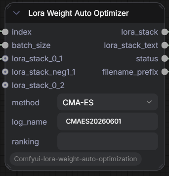

# lora-gradient-node

A lightweight ComfyUI custom node pack for LoRA weight optimization using algorithms: **CMA-ES** and **Tournament GA**.

[ExampleWorkflow.json](ExampleWorkflow.json)

## Nodes

### `LoraWeightAutoOptimizer`

Optimizes LoRA weights by sampling candidate weight combinations, letting you rank the visual results, and evolving toward better combinations over successive generations(not grid searching).

| Input | Type | Description |
|---|---|---|
| `index` | INT (forced) | Current image index within the batch (0-based). Connect to an `Int` node that increments per image. |
| `batch_size` | INT (forced) | Number of candidates per generation (≥2). |
| `method` | dropdown | Optimization algorithm: `CMA-ES` or `Tournament GA`. |
| `lora_stack_0_1` | LORA_STACK (optional) | LoRAs with weight bounds [0, 1]. |
| `lora_stack_neg1_1` | LORA_STACK (optional) | LoRAs with weight bounds [-1, 1]. |
| `lora_stack_0_2` | LORA_STACK (optional) | LoRAs with weight bounds [0, 2]. |
| `log_name` | STRING (optional) | Name for the optimization session. New runs create `logs/<log_name>/`. Existing logs are auto-resumed if LoRA names and method match. |
| `ranking` | STRING (optional) | Comma-separated ranking like `"3,1,2"`, where each number is the rank (1 = best) of the corresponding candidate. Only processed when `index=0`. |

| Output | Type | Description |
|---|---|---|
| `lora_stack` | LORA_STACK | The selected candidate's LoRA weights for the current index. |
| `lora_stack_text` | STRING | Human-readable candidate vs. estimated weights. |
| `status` | STRING | Current sigma, mean change, convergence hints, generation info. |
| `filename_prefix` | STRING | `<log_name>/<log_name>_<gen>-<index>`, you may want to link this to filename_prefix in image savers. |

## Workflow

1. Connect LoRA stacks to the optimizer (use the appropriate bounds input).
2. Set `batch_size` to the number of images you'll generate per generation. Use a number equal or greater than Lora numbers.
3. Provide a `log_name` to identify the optimization run.
4. Generate a batch of images — each uses a different candidate weight vector.
5. You rank the results (1 = best) and input ranking as comma-separated string in every runs (execpt first run).
6. The optimizer updates a new combination of weights based on it.
7. Repeat until satisfied or converged.

## Optimization Methods

### CMA-ES (Covariance Matrix Adaptation Evolution Strategy)

A population-based black-box optimizer that adapts a full covariance matrix to model the search distribution. Well-suited for continuous weight tuning with correlated dimensions. Converges when sigma drops below a threshold, with visual hints (`converged` / `near`).

### Tournament GA (Genetic Algorithm)

Uses tournament selection, blend crossover (BLX-α), and per-gene Gaussian mutation with elitism. A simpler alternative that explores via discrete generations rather than distribution adaptation.
## Log Format

All state is persisted to `<log_name>/optimization_log.json`, including:
- Current generation, sigma/mean-change metrics
- LoRA names and bounds
- All candidate weight vectors for the current generation
- Full optimizer state for exact resumption

## Notes

- Rankings must be a complete permutation of `1..batch_size` — no ties, no gaps.
- All three LoRA stack inputs are combined; each input type maps to specific weight bounds.
- The optimizer skips the update step when `index > 0` or when no ranking is provided, simply returning the stored candidate for that index.
- When resuming a log, the LoRA name list and method must match exactly, otherwise an error is raised.
- Maybe not as good as manually selecting every lora weight by observing behaviours and stacking. 
